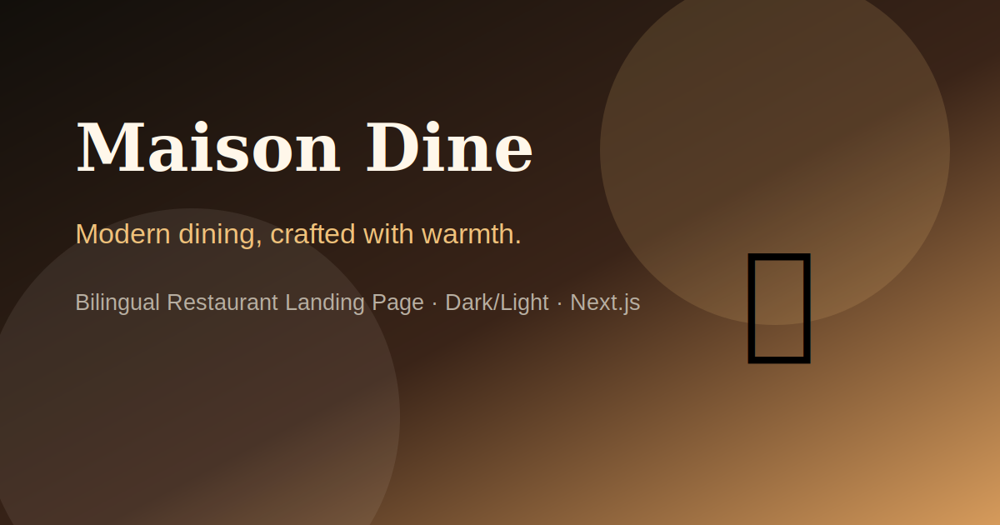

# Maison Dine — Restaurant Landing Page

A premium bilingual restaurant landing page built with **Next.js App Router**, **TypeScript**, **Tailwind CSS v4**, and a warm restaurant-focused design system.

Maison Dine is designed as a production-ready landing template, not a throwaway UI export. It includes a polished home page, authentication pages, responsive sections, dark/light mode, RTL/LTR support, local professional visuals, and SEO-ready metadata.



---

## ✨ Highlights

- **Next.js App Router** structure
- **TypeScript-first** implementation
- **Tailwind CSS v4** design tokens
- **Dark / Light mode** with `next-themes`
- **Hydration-safe theme toggle**
- **Arabic / English language switcher**
- **RTL / LTR direction support**
- **Smooth section scrolling**
- **Responsive mobile-first UX**
- **Local generated restaurant visuals** inside `public/images`
- **Home, Sign In, Sign Up, 404, and Loading pages**
- **SEO metadata + Open Graph image**
- Clean component structure ready for real product work

---

## 🧱 Tech Stack

| Layer | Tool |
|---|---|
| Framework | Next.js 16 App Router |
| Language | TypeScript |
| Styling | Tailwind CSS v4 |
| Theme | next-themes |
| Icons | lucide-react |
| UI primitives | Radix Accordion + Tabs |
| Utilities | clsx + tailwind-merge |

---

## 📁 Project Structure

```txt
src/
  app/
    layout.tsx
    page.tsx
    home-page.tsx
    loading.tsx
    not-found.tsx
    providers.tsx
    signin/
      page.tsx
      signin-page.tsx
    signup/
      page.tsx
      signup-page.tsx

  components/
    Header.tsx
    Footer.tsx
    pages/
      SignIn.tsx
      SignUp.tsx
    sections/
      Hero.tsx
      QuickInfo.tsx
      FeaturedDishes.tsx
      MenuPreview.tsx
      About.tsx
      Benefits.tsx
      Gallery.tsx
      Reviews.tsx
      Booking.tsx
      Location.tsx
      FAQ.tsx
      FinalCTA.tsx
    ui/
      Badge.tsx
      Button.tsx
      Card.tsx
      Input.tsx

  contexts/
    LanguageContext.tsx

  hooks/
    use-mounted.ts

  lib/
    utils.ts

  styles/
    fonts.css
    index.css
    tailwind.css
    theme.css

public/
  images/
    hero-dish.svg
    dish-pasta.svg
    dish-steak.svg
    dish-salmon.svg
    dish-dessert.svg
    restaurant-interior.svg
    booking-wine.svg
    auth-ambience.svg
    gallery-plate.svg
    gallery-interior.svg
    gallery-drinks.svg
    gallery-dessert.svg
    og-image.svg
```

---

## 🚀 Getting Started

### 1. Install dependencies

```bash
pnpm install
```

### 2. Start development server

```bash
pnpm dev
```

Open:

```txt
http://localhost:3000
```

### 3. Production build

```bash
pnpm build
```

### 4. Start production server

```bash
pnpm start
```

---

## 🧩 Available Pages

| Route | Description |
|---|---|
| `/` | Restaurant landing page |
| `/signin` | Sign in page |
| `/signup` | Sign up page |
| `not-found.tsx` | Custom 404 page |
| `loading.tsx` | Loading state |

---

## 🎨 Design System

The visual identity is built around a warm restaurant palette.

### Dark Mode

| Token | Color |
|---|---|
| Background | `#120F0B` |
| Surface | `#1B1712` |
| Soft Surface | `#241E17` |
| Text | `#FFF7EA` |
| Muted Text | `#B8AFA2` |
| Primary | `#D59A5B` |
| Accent | `#F0C27B` |
| Border | `#342B22` |

### Light Mode

| Token | Color |
|---|---|
| Background | `#FBF7EF` |
| Surface | `#FFFFFF` |
| Soft Surface | `#F4EBDD` |
| Text | `#1D1B18` |
| Muted Text | `#6F665B` |
| Primary | `#9A5A32` |
| Accent | `#C79057` |
| Border | `#E8DCCB` |

The light mode intentionally avoids cold white colors so the brand keeps the same premium warm feeling.

---

## 🌍 Language & Direction

The project uses a lightweight `LanguageContext` for Arabic and English content.

- English uses `ltr`
- Arabic uses `rtl`
- The root `html` `lang` and `dir` attributes are updated when switching language
- Translations are centralized in `src/contexts/LanguageContext.tsx`

For a larger production app, the next step is replacing the lightweight context with `next-intl` and route-based locales such as `/en` and `/ar`.

---

## 🌓 Theme System

Theme switching is powered by `next-themes`.

The theme icon is intentionally rendered only after the component mounts to prevent hydration mismatches between server-rendered HTML and the browser-rendered theme state.

Relevant files:

```txt
src/app/providers.tsx
src/hooks/use-mounted.ts
src/components/Header.tsx
```

---

## 🖼️ Image Strategy

All visuals are local SVG assets under:

```txt
public/images
```

Why local assets?

- No remote image dependency
- Stable builds
- Faster rendering
- No licensing risk
- Works cleanly with `next/image`
- Easy to replace later with real restaurant photography

To replace any image, keep the same filename or update the `src` value inside the related component.

Example:

```tsx
<Image
  src="/images/hero-dish.svg"
  alt="Maison Dine signature dinner plate"
  fill
  priority
  sizes="(max-width: 1024px) 90vw, 520px"
  className="object-cover"
/>
```

---

## 🧭 Smooth Scrolling

Smooth scrolling is enabled globally in:

```txt
src/styles/theme.css
```

```css
html {
  scroll-behavior: smooth;
  scroll-padding-top: 6rem;
}
```

It also respects accessibility preferences by disabling motion for users who prefer reduced motion.

---

## 🧠 Main Fixes Included

### 1. Hydration mismatch fix

The previous version rendered different theme icons on the server and client.

Example of the problem:

```txt
Server: Moon icon
Client: Sun icon
```

The fix:

- Added `useMounted()` hook
- Rendered a stable placeholder before mount
- Rendered `Sun` / `Moon` only after the client is ready

### 2. Real image assets

Replaced emoji placeholders with local generated restaurant visuals.

### 3. Cleaner navigation

Header navigation now scrolls smoothly to sections using one consistent helper.

### 4. Better mobile UX

Improved mobile menu spacing, CTA behavior, and responsive image rendering.

### 5. Dependency cleanup

Removed the masonry package and replaced the gallery with a clean CSS grid.

---

## ✅ Quality Checklist

Before publishing, run:

```bash
pnpm build
pnpm lint
```

Recommended deployment checks:

- Lighthouse performance
- Mobile layout
- Dark mode
- Light mode
- Arabic RTL layout
- English LTR layout
- Open Graph preview
- Keyboard navigation
- Form focus states

---

## 🔮 Suggested Next Improvements

- Add `next-intl` route-based localization
- Add real booking API endpoint
- Add form validation with Zod
- Add server actions for reservation submissions
- Add real CMS/menu source
- Replace generated SVGs with real optimized photography
- Add structured data JSON-LD for Restaurant SEO
- Add sitemap and robots files

---

## Git Commit Message

```bash
feat: stabilize restaurant landing page theme hydration and add local visuals
```
